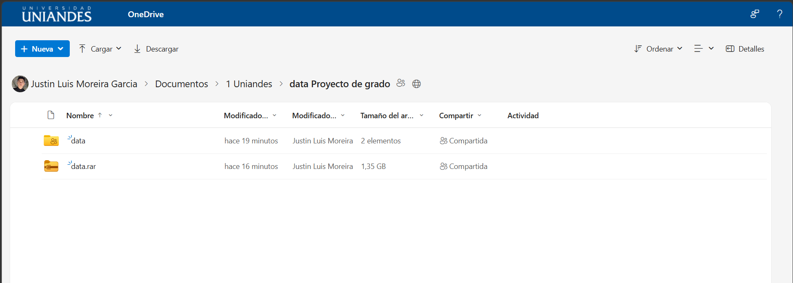
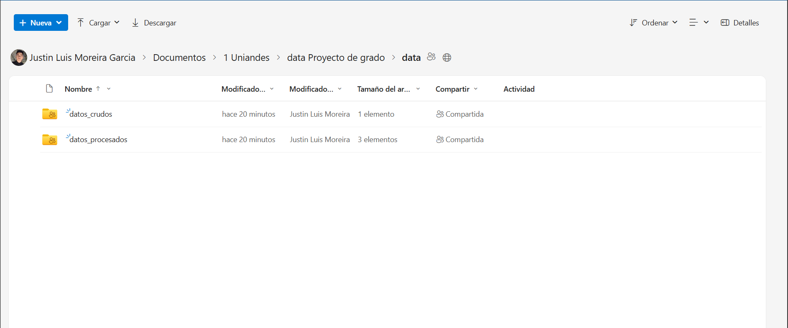

# Enlace de acceso a los datos  
Como los archivos de los datos crudos y procesados no se pueden subir a GitHub por exceder el limite de peso, se procederá a subir el **[enlace de acceso general a los archivos](https://uniandeseduec-my.sharepoint.com/:f:/g/personal/justinmg45_uniandes_edu_ec/IgBJwCpzg5L3QLFHBNd4PKK0ASlsnFBuOa75NtYJ45aUeKA?e=ze6KoM)**. Este enlace permitirá acceder a la carpeta **`data`** que contendrá los datos crudos **`Questions.csv`** y los datos procesados que estan en formato **`.parquet`**. Se recomienda bajar el archivo **`.zip`** para evitar perdida de datos en la descarga. 
## Capturas de los archivos cargados
  

